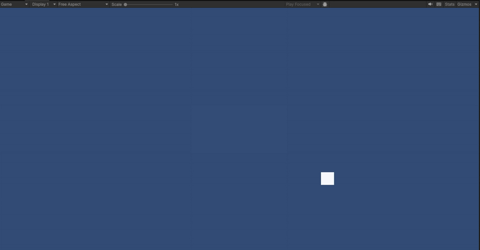
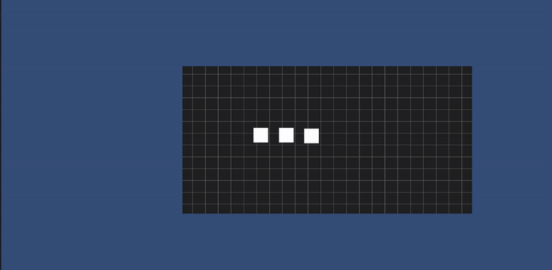
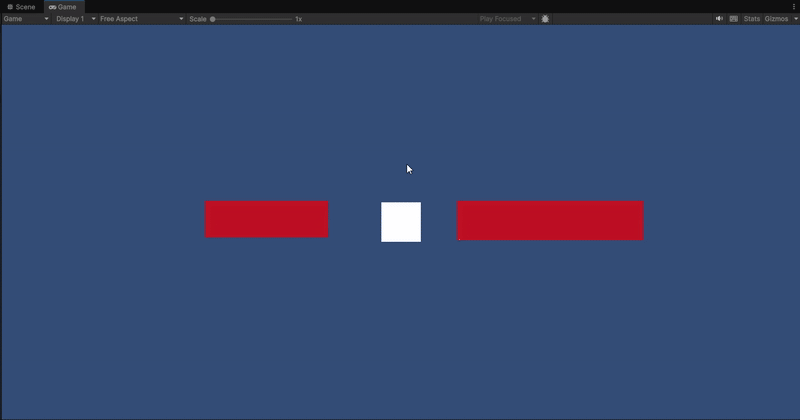

# CINEMACHINE 
## Introducción a Unity 2D - Cámara

En esta práctica se trabajó con **Cinemachine**, un sistema avanzado de control de cámaras en Unity, para explorar diferentes formas de seguimiento, efectos y transiciones de cámara en un juego 2D. Cada tarea implementó funcionalidades específicas que mejoran la experiencia de juego y la presentación visual.

### 1. Configuración de cámaras virtuales con diferentes zonas de seguimiento.

Se instalaron dos cámaras virtuales y se configuraron para seguir al jugador, asignando zonas de seguimiento distintas: Dead Zone, Soft Zone y Hard Zone. Esto permitió controlar cómo y cuándo la cámara se mueve con el personaj8e. 

### 2. Zona de confinamiento
Se utilizó la extensión Cinemachine Confiner para restringir el movimiento de cada cámara dentro de un área definida del mapa. Esto aseguró que la cámara no mostrara áreas vacías o fuera del juego y permitió definir límites distintos para cada cámara. 

### 3. Seguimiento a un grupo de objetivos
Se creó una **Target Group Camera** que siguió simultáneamente a varios objetos en movimiento. Se configuraron los pesos de cada objeto para ajustar su importancia en el encuadre. Esto permitió que la cámara centrara la vista en los elementos más relevantes y mantuviera todos los objetos visibles, simulando un seguimiento grupal.

A continuación se agregaron 2 sprites adicionales con una cámara adicional que solo sigue el movimiento de estos objetos. 

 
### 4. Zoom controlado por teclado
Se creó un script que ajusta el zoom de la cámara con las teclas W y S, modificando la propiedad Lens.OrthographicSize. Esto permite al jugador acercar o alejar la vista del entorno de manera dinámica, facilitando la exploración o concentración en detalles específicos del juego. 

### 5. Intercambio de cámaras con teclado
Se implementó un sistema que activa o desactiva dos cámaras virtuales usando las teclas 1 y 2. Esto permitió cambiar la perspectiva del jugador en tiempo real, mostrando cómo se puede alternar entre diferentes encuadres de forma rápida y sencilla mediante scripts, sin necesidad de modificar manualmente las cámaras en la escena.

### 6. Intercambio de cámaras mediante UI
Se añadió una interfaz de usuario con botones que permiten activar cada cámara al ser pulsados. 

### 7. Cámara lenta y rápida
Se implementaron cámaras adicionales que modifican la velocidad de juego usando Time.timeScale. Al colisionar con objetos específicos, se ralentizó el tiempo a 0.3 para la cámara lenta y se aceleró a 2 para la cámara rápida, activando y desactivando las cámaras correspondientes.

### 9. Transición entre cámaras usando prioridad
Se configuró un cambio de cámara mediante la propiedad Priority. Al colisionar con un objeto, la cámara confinada adquiría mayor prioridad sobre la cámara normal y viceversa.

